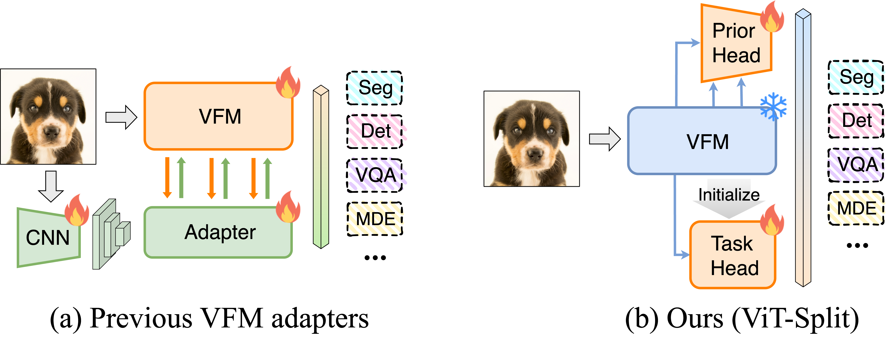
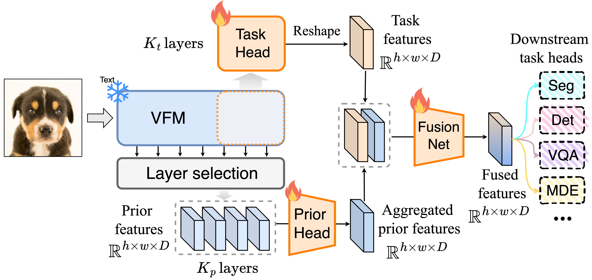

# [ICCV 2025] ViT-Split: Unleashing the Power of Vision Foundation Models via Efficient Splitting Heads

**Authors**: [Yifan Li](https://jackyfl.github.io/), [Xin Li](https://scholar.google.com/citations?hl=zh-CN&user=KkPdvB8AAAAJ), [Tianqin Li](https://crazy-jack.github.io/), [Wenbin He](https://hewenbin.github.io/), [Yu Kong](https://www.egr.msu.edu/~yukong/), [Ren Liu](https://www.liu-ren.com/)

The official implementation of our ICCV 2025 paper "[ViT-Split: Unleashing the Power of Vision Foundation Models via Efficient Splitting Heads](https://arxiv.org/pdf/2506.03433)".

[Paper](https://arxiv.org/pdf/2506.03433) | [Project](https://jackyfl.github.io/vitsplit.github.io/)

## Citation

If this work is helpful for your research, please consider citing the following BibTeX entry.

```
@article{li2025vit,
  title={ViT-Split: Unleashing the Power of Vision Foundation Models via Efficient Splitting Heads},
  author={Li, Yifan and Li, Xin and Li, Tianqin and He, Wenbin and Kong, Yu and Ren, Liu},
  journal={arXiv preprint arXiv:2506.03433},
  year={2025}
}
```

## Abstract


Vision foundation models (VFMs) have demonstrated remarkable performance across a wide range of downstream tasks. While several VFM adapters have shown promising results by leveraging the prior knowledge of VFMs, we identify two inefficiencies in these approaches. First, the interaction between convolutional neural network (CNN) and VFM backbone triggers early layer gradient backpropagation. Second, existing methods require tuning all components, adding complexity. Besides, these adapters alter VFM features, underutilizing the prior knowledge. To tackle these challenges, we propose a new approach called ViT-Split, based on a key observation: the layers of several VFMs, like DINOv2, can be divided into two distinct components: an extractor for learning low-level features and an adapter for learning task-specific features. Leveraging this insight, we eliminate the CNN branch and introduce two heads, task head and prior head, to the frozen VFM. The task head is designed to learn task-specific features, mitigating the early gradient propagation issue. The prior head is used to leverage the multi-scale prior features from the frozen VFM, reducing tuning parameters and overfitting. Extensive experiments on various tasks (e.g., segmentation, detection, and visual question answering) validate the effectiveness and efficiency of ViT-Split. Specifically, ViT-Split reduces training time up to $4\times$ while achieving comparable or even better results on ADE20K, compared to other VFM adapters.

## Method




## Experiments

We demonstrate our ViT-Split on four tasks: [segmentation](segmentation), [detection](detection), [VQA](LLaVA) and [MDE (monocular depth estimation)](Monocular-Depth-Estimation-Toolbox).

- Conda env
  - Note that detection and segmentation tasks share the same env **vitsplit**. VQA uses **vitsplit-llava** and MDE uses **vitsplit-mde**. For more information to setup the conda env, please refer to the according codebase.

## License

This repository is released under the Apache 2.0 license as found in the [LICENSE](LICENSE.md) file.

## Acknowledgement

- Thanks for these awesome opensourced projects: [ViT-Adapter](https://github.com/czczup/ViT-Adapter), [ViT-CoMer](https://github.com/Traffic-X/ViT-CoMer), [benchmark-cfm-ss](https://github.com/tue-mps/benchmark-vfm-ss), [LLaVA](https://github.com/haotian-liu/LLaVA), [MDE-toolbox](https://github.com/zhyever/Monocular-Depth-Estimation-Toolbox)!